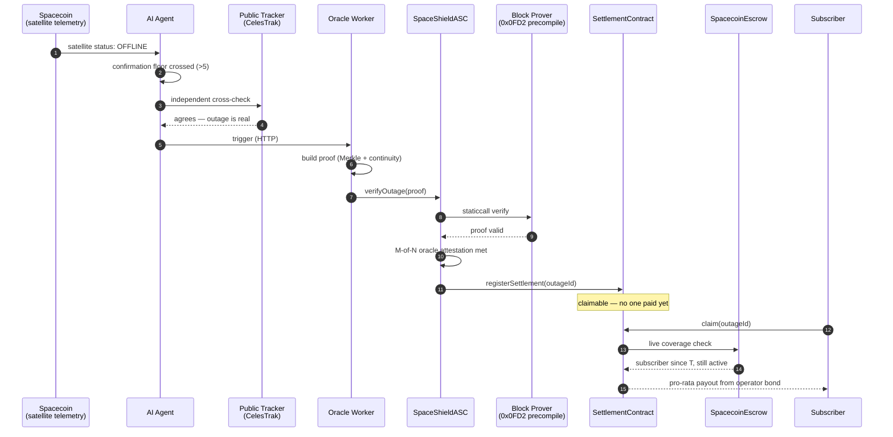

# SpaceShield

**Autonomous SLA enforcement for satellite internet.** When a Spacecoin
satellite goes dark, SpaceShield detects it, cryptographically verifies it
through Attestcoin, and settles compensation from an operator's bond on
Creditcoin — automatically, in about fifteen seconds, with zero claim forms.

> See [`architecture.md`](architecture.md) for the full design reference and
> decision log, and [`CLAUDE.md`](CLAUDE.md) if you're an AI agent picking
> this project up fresh.

## The problem

Spacecoin sells $2/month satellite internet into markets with no fallback
connection. When a satellite drops, today the user has exactly one of three
outcomes, and all three are broken:

- **Manual claims** — slow, costly, and requires someone who just lost
  connectivity to go file a report.
- **Centralized refunds** — someone has to *decide* what counts as a "real"
  outage. That someone is a trust bottleneck DePIN was supposed to remove.
- **No compensation at all** — the default. The user absorbs 100% of the
  downtime risk on infrastructure they don't control.

## What SpaceShield does instead

No human decides whether an outage happened. No human decides who gets paid.
Three independent systems each do exactly one job, and none of them have to
trust each other:

1. **Detect** — an AI agent watches Spacecoin's on-chain telemetry and
   cross-checks it against an independent public tracker (real NORAD/CelesTrak
   data) before it will trigger anything.
2. **Verify** — Attestcoin's native Block Prover precompile (`0x0FD2`)
   cryptographically checks a Merkle + continuity proof of the outage, in a
   single atomic call. Not an opinion — a proof.
3. **Settle** — Creditcoin pays out automatically from the operator's
   pre-locked bond, pro-rated to how long each subscriber was actually
   covered. Subscribers pull their own payout with one transaction. No case
   number, no adjuster, no waiting.

## How it works



Fifteen seconds, end to end, and the only actor who took an action was the
subscriber pulling their own money at the very end.

## The architecture


*SpacecoinEscrow lives under Creditcoin, not Spacecoin — confirmed in
`architecture.md` §4: Spacecoin's real payment mechanism is deployed on
Creditcoin itself, same chain as SpaceShield's own contracts, which is
exactly why `claim()` can read it live instead of trusting a snapshot.*

**Why nobody has to trust anybody:** the AI Agent never touches money — it
can only ever cause a proof attempt, and a fabricated proof is rejected by
the precompile. A single oracle can't finalize alone once
`attestationThreshold > 1`. Anyone claiming compensation is checked live
against `SpacecoinEscrow`, which SpaceShield doesn't control — you actually
have to have paid Spacecoin. Full trust-boundary table in
[`architecture.md`](architecture.md), §6.

## Proven three ways

1. **`npx hardhat test --no-compile`** — 16 passing integration tests: the
   full happy path, plus real failure modes (double-settlement, forged
   proofs, unregistered oracles, non-subscribers trying to claim,
   double-claims, withdrawn coverage losing eligibility, bond depletion +
   recovery, multi-oracle attestation thresholds, penalties routing to a
   treasury).
2. **A live multi-process run** — a real local chain, a real Python process
   (the AI Agent) talking HTTP to a real Node process (the Oracle Worker),
   submitting a real transaction, followed by a subscriber pulling their own
   compensation via a live on-chain eligibility check. The wallet-connected
   frontend can also drive this exact pipeline from a browser button.
3. **A live (blocked-but-honest) network check** — the public-tracking
   client makes a real HTTP request to CelesTrak; from a network-restricted
   sandbox it gets a real `403` back and falls back to a local fixture
   instead of silently pretending the check passed. `python3 -m unittest
   agent/test_public_tracker.py -v` — 6/6 passing against CelesTrak's real
   documented schema.

## What's real vs. mocked

Every mock in this codebase documents exactly what's real, what's
illustrative, and what a production swap would need — nothing is quietly
faked.

| Piece | Status |
|---|---|
| Contract logic (bonding, pull-based claims, live escrow-based subscriber verification, pro-rata compensation, M-of-N oracle attestation, treasury-routed penalties, idempotent settlement) | **Real** — the actual code that would ship |
| Spacecoin's payment/escrow mechanism | **Modeled faithfully** from confirmed official docs — the real deployed contract's address/ABI weren't independently locatable |
| Spacecoin's satellite-status/telemetry reporting | **Mocked** — same-chain-vs-cross-chain is a genuine open question, see `architecture.md` §3 |
| Attestcoin Block Prover precompile (`0x0FD2`) | **Mocked**, installed at the real precompile address via `hardhat_setCode` so the real ASC code never has to change |
| Proof generation (`@gluwa/usc-sdk`) | **Mocked** — fabricates a proof shaped to satisfy the mock verifier; the entire migration path to production is swapping this one module |
| AI Agent detection/cross-check/confirmation-floor logic | **Real**, independently runnable (`agent/monitor.py`) |
| Public tracking cross-check (CelesTrak) | **Real client** against the actual documented endpoint |
| Affected-user / payout verification | **Real, live, same-chain** — no snapshot, no publisher, no caller-supplied address list anywhere in the flow |
| Oracle decentralization | **Real M-of-N attestation** |
| Frontend (wallet-connected dApp + public transparency pages) | **Real** — RainbowKit/wagmi, live contract reads/writes, a browser-driven trigger for the full pipeline on the local chain |
| CI + bond-health monitoring | **Real**, runnable (`.github/workflows/test.yml`, `scripts/monitor_bonds.js`) |

## Quickstart

```bash
npm install
node scripts/build.js                  # compiles contracts (manual solc — see note below)
npx hardhat test --no-compile          # 16 passing
python3 -m unittest agent/test_public_tracker.py -v   # 6 passing
```

**Run it live:**

```bash
# 1. local chain
npx hardhat node

# 2. deploy + wire everything (contracts, oracle registration, a real
#    subscriber paying into SpacecoinEscrow) — prints deployment.json
node scripts/deploy.js

# 3. the frontend (marketing site at /, wallet-connected app at /app)
cd frontend && npm install && npm run dev

# 4. or drive it headlessly: start the Oracle Worker, then run the agent
SPACESHIELD_RPC_URL=http://127.0.0.1:8545 \
SOURCE_ADDRESS=<from deployment.json> ASC_ADDRESS=<from deployment.json> \
ORACLE_PRIVATE_KEY=<from deployment.json> node oracle-worker/worker.js

python3 agent/monitor.py --satellite SAT-014 \
  --source-address <from deployment.json> \
  --oracle-worker-url http://127.0.0.1:4001 --once
```

From the app's Network page, "Trigger outage" runs this exact pipeline as
real transactions against the local chain — no mocked timers.

*Why a manual `solc` build:* the reference sandbox this was built in has
network egress allowlisted to package registries only, so
`scripts/build.js` compiles with the `solc` npm package (bundles its own
wasm) instead of `npx hardhat compile`, which needs
`binaries.soliditylang.org`. If you have open network access, `npx hardhat
compile` works normally.

## Structure

```
contracts/          Solidity — telemetry source, escrow, ASC, settlement
agent/               Python — AI detection agent + real CelesTrak client
oracle-worker/       Node — HTTP trigger → proof → submit
scripts/             build / deploy / bond-health monitor
test/                16 end-to-end + failure-mode integration tests
frontend/            React + wagmi/RainbowKit — marketing site + dApp
architecture.md      System design, trust boundaries, decision log
```

## Known gaps

The honest, current list — see [`architecture.md`](architecture.md), §7,
for how this list connects to the design decisions above:

- **Open architectural question:** is satellite telemetry reporting
  same-chain (like payments turned out to be) or genuinely cross-chain?
  Needs real information from Spacecoin's team, not more reasoning.
- **Real Spacecoin/Creditcoin testnet integration** — needs the actual
  endpoints and a verified `SpacecoinEscrow` deployment.
- **Real Attestcoin proof pipeline** (`@gluwa/usc-sdk`) against Creditcoin's
  hosted Proof Builder service.
- Oracle Worker persistence/retry queue beyond contract-level idempotency.
- Multi-satellite support is architecturally ready (everything's keyed by
  `satelliteId`) but never load-tested with more than one.
- No chain-reorg invalidation path.
- `COMPENSATION_WINDOW` is an illustrative placeholder (`1 days`) — a real
  deployment sets this from Spacecoin's actual SLA terms.
- **Security audit and legal/regulatory review** — out of scope for an
  engineering build, both genuinely required before this moves real money.

## License

ISC — see `package.json`.
