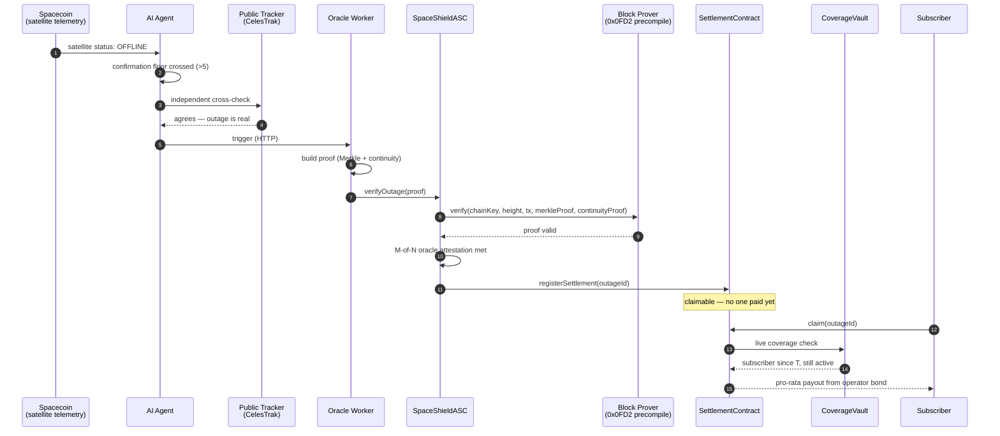
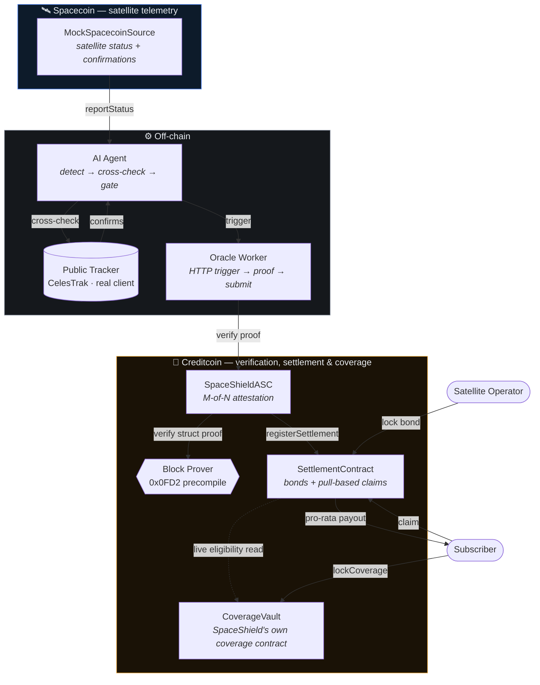

# SpaceShield

**Autonomous SLA enforcement for satellite internet.** When a Spacecoin
satellite goes dark, SpaceShield detects it, cryptographically verifies it
through Attestcoin, and settles compensation from an operator's bond on
Creditcoin — automatically, in about fifteen seconds, with zero claim forms.

> See [`architecture.md`](architecture.md) for the full design reference and
> decision log, and [`CLAUDE.md`](CLAUDE.md) if you're an AI agent picking
> this project up fresh.

## The problem

Spacecoin sells $2/month satellite internet into markets with no fallback
connection. When a satellite drops, today the user has exactly one of three
outcomes, and all three are broken:

- **Manual claims** — slow, costly, and requires someone who just lost
  connectivity to go file a report.
- **Centralized refunds** — someone has to *decide* what counts as a "real"
  outage. That someone is a trust bottleneck DePIN was supposed to remove.
- **No compensation at all** — the default. The user absorbs 100% of the
  downtime risk on infrastructure they don't control.

## What SpaceShield does instead

No human decides whether an outage happened. No human decides who gets paid.
Three independent systems each do exactly one job, and none of them have to
trust each other:

1. **Detect** — an AI agent watches Spacecoin's on-chain telemetry and
   cross-checks it against an independent public tracker (real NORAD/CelesTrak
   data) before it will trigger anything.
2. **Verify** — Attestcoin's native Block Prover precompile (`0x0FD2`)
   cryptographically checks a Merkle + continuity proof of the outage, in a
   single atomic call. Not an opinion — a proof.
3. **Settle** — Creditcoin pays out automatically from the operator's
   pre-locked bond, pro-rated to how long each subscriber was actually
   covered. Subscribers pull their own payout with one transaction. No case
   number, no adjuster, no waiting.

## How it works



Fifteen seconds, end to end, and the only actor who took an action was the
subscriber pulling their own money at the very end.

## The architecture



*CoverageVault is SpaceShield's own contract, not a model of Spacecoin's.*
An earlier version of this repo modeled a Spacecoin payment contract from a
single line of documentation and called it `SpacecoinEscrow`. With real
network access, the actual deployed contract was found and read (verified
source, Creditcoin's own explorer) — it's a prepaid, usage-metered
data-payment escrow with no concept of "coverage" or "subscription" at all,
so it can't answer the question SpaceShield needs answered. Rather than
force that fit, SpaceShield's coverage is now honestly its own product. See
[`architecture.md`](architecture.md), §4, for the full evidence and
reasoning, including the addresses of the real contract that was found.

**Why nobody has to trust anybody:** the AI Agent never touches money — it
can only ever cause a proof attempt, and a fabricated proof is rejected by
the precompile. A single oracle can't finalize alone once
`attestationThreshold > 1`. Anyone claiming compensation is checked live
against `CoverageVault` — SpaceShield's own on-chain coverage record, not a
caller-supplied list. Full trust-boundary table in
[`architecture.md`](architecture.md), §6.

## Proven three ways

1. **`npx hardhat test --no-compile`** — 16 passing integration tests: the
   full happy path, plus real failure modes (double-settlement, forged
   proofs, unregistered oracles, non-subscribers trying to claim,
   double-claims, withdrawn coverage losing eligibility, bond depletion +
   recovery, multi-oracle attestation thresholds, penalties routing to a
   treasury).
2. **A live multi-process run** — a real local chain, a real Python process
   (the AI Agent) talking HTTP to a real Node process (the Oracle Worker),
   submitting a real transaction, followed by a subscriber pulling their own
   compensation via a live on-chain eligibility check. The wallet-connected
   frontend can also drive this exact pipeline from a browser button.
3. **A real, live network check** — the public-tracking client makes a real
   HTTP request to CelesTrak. Run against real satellite data (catalog
   number 25544 / ISS, which `agent/satellite_catalog.json` maps SAT-014 to
   for exactly this reason): a real, fresh, plausible result, no fixture
   fallback needed. `python3 -m unittest agent/test_public_tracker.py -v`
   — 6/6 passing against CelesTrak's real documented schema.

## What's real vs. mocked

Every mock in this codebase documents exactly what's real, what's
illustrative, and what a production swap would need — nothing is quietly
faked.

| Piece | Status |
|---|---|
| Contract logic (bonding, pull-based claims, live coverage-based subscriber verification, pro-rata compensation, M-of-N oracle attestation, treasury-routed penalties, idempotent settlement) | **Real** — the actual code that would ship |
| Subscriber coverage (`CoverageVault.sol`) | **Real, SpaceShield's own contract** — not a model of Spacecoin's payment system (an earlier version incorrectly claimed to be; see `architecture.md` §4 for what the real Spacecoin contract turned out to be and why it can't serve this purpose) |
| Attestcoin Block Prover interface | **Real ABI**, confirmed from the `usc-sdk` package's shipped artifacts (interface `INativeQueryVerifier`) — an earlier version guessed a flat-bytes signature that would have reverted against the real precompile on every call |
| Attestcoin Block Prover precompile itself | **Mocked locally** (`MockBlockProver.sol`, installed at the real `0x0FD2` address via `hardhat_setCode`, now speaking the real ABI byte-for-byte) — **tested for real against CC3-testnet** (2026-09-01): `verifyOutage()` reverted with `"precompile call failed"`, meaning nothing at `0x0FD2` on that network currently answers to the confirmed real interface. See `architecture.md` §4a |
| Spacecoin's satellite-status/telemetry reporting | **Mocked** — same-chain-vs-cross-chain is a genuine open question, see `architecture.md` §3 |
| Proof *shape* (Merkle/continuity struct format) | **Real** — matches the confirmed real precompile interface |
| Proof *content* | **Fabricated** — there's no real Spacecoin transaction yet to build a genuine proof from; swapping `oracle-worker/proofBuilder.js`'s body for a real `usc-sdk` `ProofBuilder` call is the remaining step, once telemetry (above) is real |
| AI Agent detection/cross-check/confirmation-floor logic | **Real**, independently runnable (`agent/monitor.py`) |
| Public tracking cross-check (CelesTrak) | **Real**, live-tested against real satellite data, not just reachable in principle |
| Affected-user / payout verification | **Real, live, same-chain** — no snapshot, no publisher, no caller-supplied address list anywhere in the flow |
| Oracle decentralization | **Real M-of-N attestation** |
| Frontend (wallet-connected dApp + public transparency pages) | **Real** — RainbowKit/wagmi, live contract reads/writes, a browser-driven trigger for the full pipeline on the local chain |
| CI + bond-health monitoring | **Real**, runnable (`.github/workflows/test.yml`, `scripts/monitor_bonds.js`) |
| Creditcoin CC3-testnet deployment | **Done, for real** — deployed 2026-09-01, see "Live testnet deployment" below |

## Quickstart

```bash
npm install
node scripts/build.js                  # compiles contracts (manual solc, fast, works everywhere)
npx hardhat test --no-compile          # 16 passing
python3 -m unittest agent/test_public_tracker.py -v   # 6 passing
```

`npx hardhat compile` also works directly now (`viaIR: true` is set in
`hardhat.config.js`) if you'd rather use it — `scripts/build.js`'s manual
`solc` path is just faster and doesn't need `binaries.soliditylang.org`
reachable, so it's still the default.

**Run it live (local chain):**

```bash
# 1. local chain
npx hardhat node

# 2. deploy + wire everything (contracts, oracle registration, a real
#    subscriber locking coverage) — prints deployment.json
node scripts/deploy.js

# 3. the frontend (marketing site at /, wallet-connected app at /app)
cd frontend && npm install && npm run dev

# 4. or drive it headlessly: start the Oracle Worker, then run the agent
SPACESHIELD_RPC_URL=http://127.0.0.1:8545 \
SOURCE_ADDRESS=<from deployment.json> ASC_ADDRESS=<from deployment.json> \
ORACLE_PRIVATE_KEY=<from deployment.json> node oracle-worker/worker.js

python3 agent/monitor.py --satellite SAT-014 \
  --source-address <from deployment.json> \
  --oracle-worker-url http://127.0.0.1:4001 --once
```

From the app's Network page, "Trigger outage" runs this exact pipeline as
real transactions against the local chain — no mocked timers.

**Real testnet deployment (Creditcoin CC3-testnet):**

```bash
cp .env.example .env
# fill in CC3_TESTNET_PRIVATE_KEY — a wallet funded with testnet tCTC
# (see "What you need to do" below for how to get one)
npx hardhat run scripts/deploy-testnet.js --network creditcoinTestnet
```

This is a genuinely different script from `scripts/deploy.js`, not the same
thing pointed at a different network — see its header comment for why (no
`hardhat_setCode` on a real chain, no 8 auto-funded roles, and it's a real
test of whether the Attestcoin precompile is actually live at `0x0FD2` on
that network, which this repo cannot confirm from a read-only scan).

### Live testnet deployment

Deployed for real on Creditcoin CC3-testnet, 2026-09-01 (see
`deployment.testnet.json`; addresses also below for anyone reading this
without that file). Operator, oracle, and treasury all point at the same
deployer address — a single-key solo deployment, not a multi-party one; see
`scripts/deploy-testnet.js`'s header for why that's the sane default for a
first real deployment.

| Contract | Address |
|---|---|
| MockSpacecoinSource | [`0xa221F85CD183427F755Cf23bc7e799ec44B4D165`](https://creditcoin-testnet.blockscout.com/address/0xa221F85CD183427F755Cf23bc7e799ec44B4D165) |
| CoverageVault | [`0xc4F3a0311B9f87B48b406bDA890E7D18357D5A56`](https://creditcoin-testnet.blockscout.com/address/0xc4F3a0311B9f87B48b406bDA890E7D18357D5A56) |
| SettlementContract | [`0x66C3BFC91CE2Ffdfd835c81D64FF78F06A5eD7b5`](https://creditcoin-testnet.blockscout.com/address/0x66C3BFC91CE2Ffdfd835c81D64FF78F06A5eD7b5) |
| SpaceShieldASC | [`0xBcAE9e419B84a0279F3C9B9A4FFa56B05dEbA656`](https://creditcoin-testnet.blockscout.com/address/0xBcAE9e419B84a0279F3C9B9A4FFa56B05dEbA656) |

**The one real thing this deployment already tested: the Attestcoin
precompile question.** A real `verifyOutage()` call against the real
`SpaceShieldASC` above reverted with `"precompile call failed"` — nothing
at `0x0FD2` on this testnet currently answers to the confirmed real
`INativeQueryVerifier` interface. That's not a bug in this repo to fix;
it's the actual, current answer, and it's now a concrete question ("we
called `verify(...)` at `0x0FD2` on CC3-testnet and it reverted — is the
precompile live there?") to put to Creditcoin/Gluwa directly, not a
hypothetical one. See `architecture.md` §4a.

## Structure

```
contracts/          Solidity — telemetry source, coverage vault, ASC, settlement
agent/               Python — AI detection agent + real CelesTrak client
oracle-worker/       Node — HTTP trigger → proof → submit
scripts/             build / deploy (local + real testnet) / bond-health monitor
test/                16 end-to-end + failure-mode integration tests
frontend/            React + wagmi/RainbowKit — marketing site + dApp
architecture.md      System design, trust boundaries, decision log
```

## Known gaps

The honest, current list — see [`architecture.md`](architecture.md), §7,
for how this list connects to the design decisions above:

- **Open architectural question:** is satellite telemetry reporting
  same-chain (like payments turned out to be) or genuinely cross-chain?
  Needs real information from Spacecoin's team, not more reasoning.
- **Real Attestcoin proof content** — the proof *shape* is now confirmed
  real; the proof *content* is still fabricated because there's no real
  Spacecoin transaction to point a real `usc-sdk` `ProofBuilder` at yet.
- Whether Creditcoin CC3-testnet's `0x0FD2` actually carries the real
  Block Prover precompile with the confirmed interface — **now tested**,
  and as of 2026-09-01 the answer is no (see "Live testnet deployment"
  above). Needs a response from Creditcoin/Gluwa, not more testing from
  this side.
- Oracle Worker persistence/retry queue beyond contract-level idempotency.
- Multi-satellite support is architecturally ready (everything's keyed by
  `satelliteId`) but never load-tested with more than one.
- No chain-reorg invalidation path.
- `COMPENSATION_WINDOW` is an illustrative placeholder (`1 days`) — a real
  deployment sets this from Spacecoin's actual SLA terms.
- Whether `CoverageVault` should additionally read Spacecoin's real
  `TokenPaymentEscrow` as a secondary signal is an open product question,
  not an engineering one — see `architecture.md` §4.
- **Security audit and legal/regulatory review** — out of scope for an
  engineering build, both genuinely required before this moves real money.

## What you need to do

Everything above that was fixable from here has been fixed — contract
naming/claims corrected, the real Attestcoin interface wired in throughout,
real testnet infrastructure added, docs corrected to match. What's left
needs either your credentials, your judgment call, or a conversation with
Spacecoin's team — none of it is something more code from here can resolve:

1. ~~Fund a Creditcoin CC3-testnet wallet and provide its private key~~ —
   **done, 2026-09-01.** Real deployment live, addresses in "Live testnet
   deployment" above. It also answered the question this step existed to
   answer: the real Attestcoin precompile does not currently respond at
   `0x0FD2` on this testnet. **New action:** raise this with
   Creditcoin/Gluwa directly — "we called `verifyOutage()` against a real
   deployed ASC on CC3-testnet and it reverted at the precompile call" is
   now a concrete, reproducible report, not a hypothetical.
2. **Decide CoverageVault's relationship to Spacecoin's real
   `TokenPaymentEscrow`** — stay fully independent (current state, and
   arguably the more honest default), or additionally require some signal
   from the real contract (e.g. a minimum recent claimed-data balance) as
   a secondary eligibility check. This is a product call about what
   "actively a Spacecoin customer" should mean, not something to guess at.
3. **Get a WalletConnect Cloud project ID** (free, at
   cloud.walletconnect.com) if you want the QR-code wallet-connect flow in
   the app — injected wallets like MetaMask already work without it.
4. **Talk to Spacecoin's team** about the one real open architectural
   question left: is satellite telemetry reporting same-chain or
   cross-chain? Everything downstream of that (whether the Attestcoin
   precompile layer is even the right shape) depends on the answer.
5. **Commission a security audit and legal/regulatory review** before any
   of this touches real funds — both are genuinely out of scope for an
   engineering pass, regardless of environment.

## License

ISC — see `package.json`.
