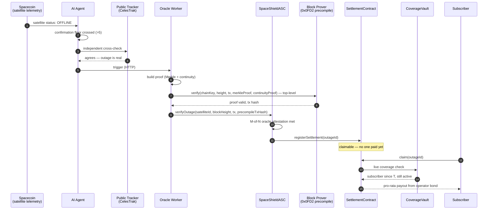
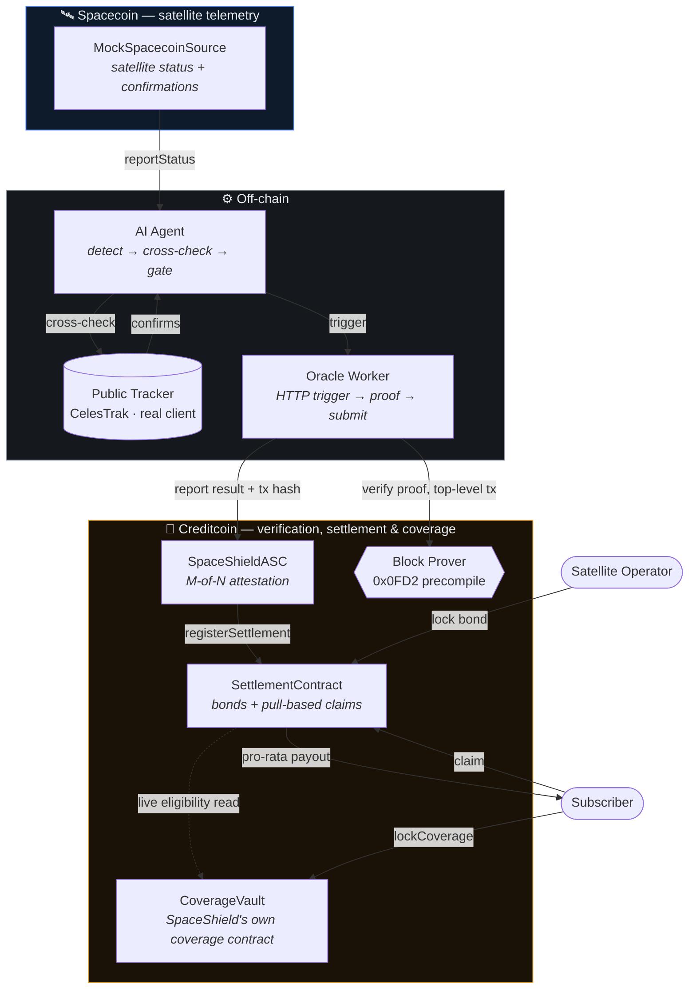

# SpaceShield

**Autonomous SLA enforcement for satellite internet.** When a Spacecoin
satellite goes dark, SpaceShield detects it, cryptographically verifies it
through Attestcoin, and settles compensation from an operator's bond on
Creditcoin — automatically, in about fifteen seconds, with zero claim forms.

> See [`architecture.md`](architecture.md) for the full design reference and
> decision log, and [`CLAUDE.md`](CLAUDE.md) if you're an AI agent picking
> this project up fresh.

## The problem

Spacecoin sells $2/month satellite internet into markets with no fallback
connection. When a satellite drops, today the user has exactly one of three
outcomes, and all three are broken:

- **Manual claims** — slow, costly, and requires someone who just lost
  connectivity to go file a report.
- **Centralized refunds** — someone has to *decide* what counts as a "real"
  outage. That someone is a trust bottleneck DePIN was supposed to remove.
- **No compensation at all** — the default. The user absorbs 100% of the
  downtime risk on infrastructure they don't control.

## What SpaceShield does instead

No human decides whether an outage happened. No human decides who gets paid.
Three independent systems each do exactly one job, and none of them have to
trust each other:

1. **Detect** — an AI agent watches satellite status (mocked, pending real
   Spacecoin telemetry — see `architecture.md` §3) and cross-checks it
   against an independent public tracker (real NORAD/CelesTrak data)
   before it will trigger anything.
2. **Verify** — Attestcoin's native Block Prover precompile (`0x0FD2`)
   cryptographically checks a Merkle + continuity proof of the outage. Not
   an opinion — a proof, checked directly against the real precompile by
   each independent oracle (confirmed, by testing against real Creditcoin
   CC3-testnet, to only answer top-level calls — see `architecture.md`
   §4a for why that's not a single atomic in-contract call).
3. **Settle** — Creditcoin pays out automatically from the operator's
   pre-locked bond, pro-rated to how long each subscriber was actually
   covered. Subscribers pull their own payout with one transaction. No case
   number, no adjuster, no waiting.

## How it works



Fifteen seconds, end to end, and the only actor who took an action was the
subscriber pulling their own money at the very end.

## The architecture



*CoverageVault is SpaceShield's own contract, not a model of Spacecoin's.*
An earlier version of this repo modeled a Spacecoin payment contract from a
single line of documentation and called it `SpacecoinEscrow`. With real
network access, the actual deployed contract was found and read (verified
source, Creditcoin's own explorer) — it's a prepaid, usage-metered
data-payment escrow with no concept of "coverage" or "subscription" at all,
so it can't answer the question SpaceShield needs answered. Rather than
force that fit, SpaceShield's coverage is now honestly its own product. See
[`architecture.md`](architecture.md), §4, for the full evidence and
reasoning, including the addresses of the real contract that was found.

**Why nobody has to trust anybody:** the AI Agent never touches money — it
can only ever cause a proof attempt, and a fabricated proof is rejected by
the precompile itself when the oracle checks it (confirmed against real
Creditcoin CC3-testnet — see `architecture.md` §4a for why that check now
happens off-chain, by the oracle, rather than inside `SpaceShieldASC`). A
single oracle can't finalize alone once `attestationThreshold > 1` — that
threshold carries more of the trust load precisely because the contract
itself can no longer re-verify the proof math. Anyone claiming compensation
is checked live against `CoverageVault` — SpaceShield's own on-chain
coverage record, not a caller-supplied list. Full trust-boundary table in
[`architecture.md`](architecture.md), §6.

## Proven three ways

1. **`npx hardhat test --no-compile`** — 16 passing integration tests: the
   full happy path, plus real failure modes (double-settlement, forged
   proofs, unregistered oracles, non-subscribers trying to claim,
   double-claims, withdrawn coverage losing eligibility, bond depletion +
   recovery, multi-oracle attestation thresholds, penalties routing to a
   treasury).
2. **A live multi-process run** — a real local chain, a real Python process
   (the AI Agent) talking HTTP to a real Node process (the Oracle Worker),
   submitting a real transaction, followed by a subscriber pulling their own
   compensation via a live on-chain eligibility check. The wallet-connected
   frontend can also drive this exact pipeline from a browser button.
3. **A real, live network check** — the public-tracking client makes a real
   HTTP request to CelesTrak. Run against real satellite data (catalog
   number 25544 / ISS, which `agent/satellite_catalog.json` maps SAT-014 to
   for exactly this reason): a real, fresh, plausible result, no fixture
   fallback needed. `python3 -m unittest agent/test_public_tracker.py -v`
   — 6/6 passing against CelesTrak's real documented schema.

## What's real vs. mocked

Every mock in this codebase documents exactly what's real, what's
illustrative, and what a production swap would need — nothing is quietly
faked.

| Piece | Status |
|---|---|
| Contract logic (bonding, pull-based claims, live coverage-based subscriber verification, pro-rata compensation, M-of-N oracle attestation, treasury-routed penalties, idempotent settlement) | **Real** — the actual code that would ship |
| Subscriber coverage (`CoverageVault.sol`) | **Real, SpaceShield's own contract** — not a model of Spacecoin's payment system (an earlier version incorrectly claimed to be; see `architecture.md` §4 for what the real Spacecoin contract turned out to be and why it can't serve this purpose) |
| Attestcoin Block Prover interface | **Real ABI**, confirmed from the `usc-sdk` package's shipped artifacts (interface `INativeQueryVerifier`) — an earlier version guessed a flat-bytes signature that would have reverted against the real precompile on every call |
| Attestcoin Block Prover precompile itself | **Confirmed real and live** on Creditcoin CC3-testnet (tested 2026-09-01) — but only when called top-level (as a transaction's direct target), never nested inside another contract's execution. That's a real constraint discovered by testing, not a guess, and it changed the architecture: verification now happens off-chain, by the Oracle Worker, calling the precompile directly (`oracle-worker/precompileClient.js`); `SpaceShieldASC.verifyOutage()` no longer calls it at all. Locally, `MockBlockProver.sol` (installed at the real `0x0FD2` address via `hardhat_setCode`) speaks the same real ABI and is called the same top-level way. See `architecture.md` §4a for the full elimination trail |
| Spacecoin's satellite-status/telemetry reporting | **Mocked, and confirmed why it has to be**: Spacecoin's own docs (`docs.spacecoin.org/network/how-it-works`) describe only transaction hashes and payment proofs as on-chain — no satellite status/uptime feed exists to read from yet, on any chain. Outreach to Spacecoin's team for final confirmation is pending; see `architecture.md` §3 |
| Proof *shape* (Merkle/continuity struct format) | **Real** — matches the confirmed real precompile interface |
| Proof *content* | **Fabricated** — there's no real Spacecoin transaction yet to build a genuine proof from; swapping `oracle-worker/proofBuilder.js`'s body for a real `usc-sdk` `ProofBuilder` call is the remaining step, once telemetry (above) is real |
| AI Agent detection/cross-check/confirmation-floor logic | **Real**, independently runnable (`agent/monitor.py`) |
| Public tracking cross-check (CelesTrak) | **Real**, live-tested against real satellite data, not just reachable in principle |
| Affected-user / payout verification | **Real, live, same-chain** — no snapshot, no publisher, no caller-supplied address list anywhere in the flow |
| Oracle decentralization | **Real M-of-N attestation** |
| Frontend (wallet-connected dApp + public transparency pages) | **Real** — RainbowKit/wagmi, live contract reads/writes, a browser-driven trigger for the full pipeline on the local chain |
| CI + bond-health monitoring | **Real**, runnable (`.github/workflows/test.yml`, `scripts/monitor_bonds.js`) |
| Creditcoin CC3-testnet deployment | **Done, for real** — deployed 2026-09-01, redeployed 2026-09-03 with the corrected `SpaceShieldASC` (previous addresses superseded), see "Live testnet deployment" below |

## Quickstart

```bash
npm install
node scripts/build.js                  # compiles contracts (manual solc, fast, works everywhere)
npx hardhat test --no-compile          # 16 passing
python3 -m unittest agent/test_public_tracker.py -v   # 6 passing
```

`npx hardhat compile` also works directly now (`viaIR: true` is set in
`hardhat.config.js`) if you'd rather use it — `scripts/build.js`'s manual
`solc` path is just faster and doesn't need `binaries.soliditylang.org`
reachable, so it's still the default.

**Run it live (local chain):**

```bash
# 1. local chain
npx hardhat node

# 2. deploy + wire everything (contracts, oracle registration, a real
#    subscriber locking coverage) — prints deployment.json
node scripts/deploy.js

# 3. the frontend (marketing site at /, wallet-connected app at /app)
cd frontend && npm install && npm run dev

# 4. or drive it headlessly: start the Oracle Worker, then run the agent
SPACESHIELD_RPC_URL=http://127.0.0.1:8545 \
SOURCE_ADDRESS=<from deployment.json> ASC_ADDRESS=<from deployment.json> \
ORACLE_PRIVATE_KEY=<from deployment.json> node oracle-worker/worker.js

python3 agent/monitor.py --satellite SAT-014 \
  --source-address <from deployment.json> \
  --oracle-worker-url http://127.0.0.1:4001 --once
```

From the app's Network page, "Trigger outage" runs this exact pipeline as
real transactions against the local chain — no mocked timers.

**Real testnet deployment (Creditcoin CC3-testnet):**

```bash
cp .env.example .env
# fill in CC3_TESTNET_PRIVATE_KEY — a wallet funded with testnet tCTC
# (see "What you need to do" below for how to get one)
npx hardhat run scripts/deploy-testnet.js --network creditcoinTestnet
```

This is a genuinely different script from `scripts/deploy.js`, not the same
thing pointed at a different network — see its header comment for why (no
`hardhat_setCode` on a real chain, no 8 auto-funded roles, and it's a real
test of whether the Attestcoin precompile is actually live at `0x0FD2` on
that network, which this repo cannot confirm from a read-only scan).

### Public testnet demo (Oracle Worker)

On testnet, `SpaceShieldASC.verifyOutage()` requires a *registered oracle*
— a visitor's own wallet never is one, and never should be (that's the
whole point of oracle attestation). So "Trigger outage" on the public site
needs one small, always-on backend running somewhere persistent, holding
the real oracle key server-side — never in the browser. Everything else a
visitor does (reporting the outage, calling the real Attestcoin precompile,
claiming a payout) is their own wallet signing a real transaction; see
`frontend/src/lib/demoTrigger.js`'s `runTriggerOutageTestnet()` and
`oracle-worker/worker.js`'s `POST /attest` for the exact split and why the
worker independently re-checks the precompile transaction before attesting
to it rather than trusting the browser's word for it.

To stand this up (e.g. on [Render](https://render.com), free tier, as a
Web Service):

1. Connect your GitHub repo, set the start command to `npm start` (already
   wired to `node oracle-worker/worker.js`) and leave the build command as
   `npm install`.
2. Set these environment variables in Render's dashboard — **never** paste
   `ORACLE_PRIVATE_KEY` anywhere outside your own hosting provider's own
   secrets UI:
   - `SPACESHIELD_RPC_URL` = `https://rpc.cc3-testnet.creditcoin.network`
   - `SOURCE_ADDRESS`, `ASC_ADDRESS` = from `deployment.testnet.json`
   - `ORACLE_PRIVATE_KEY` = the same key already funded and used for
     `deploy-testnet.js` (it registered that address as the oracle) — copy
     it from your own `.env`'s `CC3_TESTNET_PRIVATE_KEY`
   - `CORS_ORIGIN` = your deployed frontend's origin (or leave unset for `*`
     during setup)
3. Once it's live, set `VITE_ORACLE_WORKER_URL` in `frontend/.env` (and on
   Vercel) to the Render service's URL, redeploy the frontend. "Trigger
   outage" now shows up on the public site.

Render's free tier sleeps after inactivity (~50s cold start on the first
request after a while) — fine for a demo, not for uptime-sensitive use.

### Live testnet deployment

Deployed for real on Creditcoin CC3-testnet, 2026-09-03 (see
`deployment.testnet.json`; addresses also below for anyone reading this
without that file). This is a redeployment of the corrected
`SpaceShieldASC` — the 2026-09-01 deployment's addresses are superseded;
its `verifyOutage()` called the precompile internally, which the testing
below proved doesn't work on real Creditcoin. Operator, oracle, and
treasury all point at the same deployer address — a single-key solo
deployment, not a multi-party one; see `scripts/deploy-testnet.js`'s
header for why that's the sane default for a first real deployment.

| Contract | Address |
|---|---|
| MockSpacecoinSource | [`0xBDBFCFa52d153255CFC64a18e552ff826c53c0B7`](https://creditcoin-testnet.blockscout.com/address/0xBDBFCFa52d153255CFC64a18e552ff826c53c0B7) |
| CoverageVault | [`0xC1Db5E73A139c6Fd4Eac6321ee31F7876d8f1d34`](https://creditcoin-testnet.blockscout.com/address/0xC1Db5E73A139c6Fd4Eac6321ee31F7876d8f1d34) |
| SettlementContract | [`0xF5F31F256Dcd5b27f480600F8B660D936Be4c4Ec`](https://creditcoin-testnet.blockscout.com/address/0xF5F31F256Dcd5b27f480600F8B660D936Be4c4Ec) |
| SpaceShieldASC | [`0xC1d9eA6DeDD6C1f1290220DC91fbC8fD2b134C97`](https://creditcoin-testnet.blockscout.com/address/0xC1d9eA6DeDD6C1f1290220DC91fbC8fD2b134C97) |

**The precompile question this deployment exists to answer, resolved by
elimination, not assumption.** A real `verifyOutage()` call against the
*previous* deployment's `SpaceShieldASC` (which still called the
precompile internally) reverted with `"precompile call failed"`. That
looked like "nothing's there." Follow-up top-level calls — `usc-sdk`'s own
client, and a hand-rolled equivalent — proved otherwise: the precompile
IS live at `0x0FD2` and returns a real, specific rejection of a fake proof
(`"Merkle proof validation failed"`). The constraint was call context, not
existence — the precompile only answers a transaction where it's the
direct, top-level target, never one nested inside another contract. This
redeployment's `SpaceShieldASC` reflects that: `verifyOutage()` no longer
calls `0x0FD2` at all; the Oracle Worker does, directly
(`oracle-worker/precompileClient.js`), and reports the result. Full
elimination trail in `architecture.md` §4a; reproduce the precompile check
itself with `node scripts/check-precompile.js --network
creditcoinTestnet`.

Note: a full real settlement on this testnet deployment still can't
complete end-to-end yet — not because of the precompile (that's resolved),
but because the proof *content* the Oracle Worker builds is still
fabricated (`oracle-worker/proofBuilder.js`), since there's no real
Spacecoin transaction yet to build a genuine Merkle proof from. Submitting
it will correctly get rejected by the real precompile, exactly like
`check-precompile.js` demonstrates — that's the real precompile doing its
job, not a bug.

## Structure

```
contracts/          Solidity — telemetry source, coverage vault, ASC, settlement
agent/               Python — AI detection agent + real CelesTrak client
oracle-worker/       Node — HTTP trigger → proof → verify against precompile → submit
scripts/             build / deploy (local + real testnet) / precompile check / bond-health monitor
test/                16 end-to-end + failure-mode integration tests
frontend/            React + wagmi/RainbowKit — marketing site + dApp
architecture.md      System design, trust boundaries, decision log
```

## Known gaps

The honest, current list — see [`architecture.md`](architecture.md), §7,
for how this list connects to the design decisions above:

- **Satellite telemetry isn't published on-chain anywhere today** —
  confirmed from Spacecoin's own docs (`docs.spacecoin.org/network/how-it-works`
  describes only transaction hashes and payment proofs as on-chain), not
  yet confirmed directly by their team (outreach sent, no reply yet — see
  `architecture.md` §3). Detection has to stay off-chain (as it already
  is) until that changes.
- **Real Attestcoin proof content** — the proof *shape* is now confirmed
  real; the proof *content* is still fabricated because there's no real
  Spacecoin transaction to point a real `usc-sdk` `ProofBuilder` at yet.
- Oracle Worker persistence/retry queue beyond contract-level idempotency.
- The Oracle Worker's `/attest` endpoint exists and is tested, but isn't
  hosted anywhere persistent yet — see "What you need to do" below. Until
  it is, "Trigger outage" on the public testnet site has nothing to call
  and won't show as available.
- Multi-satellite support is architecturally ready (everything's keyed by
  `satelliteId`) but never load-tested with more than one.
- No chain-reorg invalidation path.
- `COMPENSATION_WINDOW` is an illustrative placeholder (`1 days`) — a real
  deployment sets this from Spacecoin's actual SLA terms.
- Whether `CoverageVault` should additionally read Spacecoin's real
  `TokenPaymentEscrow` as a secondary signal is an open product question,
  not an engineering one — see `architecture.md` §4.
- **Security audit and legal/regulatory review** — out of scope for an
  engineering build, both genuinely required before this moves real money.

## What you need to do

Everything above that was fixable from here has been fixed — contract
naming/claims corrected, the real Attestcoin interface wired in throughout,
real testnet infrastructure added, docs corrected to match. What's left
needs either your credentials, your judgment call, or a conversation with
Spacecoin's team — none of it is something more code from here can resolve:

1. ~~Fund a Creditcoin CC3-testnet wallet and provide its private key~~ —
   **done, 2026-09-01.** Real deployment live, addresses in "Live testnet
   deployment" above. It also answered the question this step existed to
   answer, by elimination: the real Attestcoin precompile IS live at
   `0x0FD2`, but only answers a top-level call, never one nested inside
   another contract — see `architecture.md` §4a. **That finding has now
   been built into the code**: `SpaceShieldASC.verifyOutage()` no longer
   calls the precompile itself; the Oracle Worker does, directly, as its
   own transaction. No further action needed on this item.
2. **Deploy the Oracle Worker somewhere persistent (e.g. Render) so
   "Trigger outage" works on the public site, not just localhost** — see
   "Public testnet demo (Oracle Worker)" above for exact steps. Needs your
   own Render account and pasting your already-funded
   `CC3_TESTNET_PRIVATE_KEY` into Render's own secrets UI (never anywhere
   else) — that's the one step here only you can do.
3. **Decide CoverageVault's relationship to Spacecoin's real
   `TokenPaymentEscrow`** — stay fully independent (current state, and
   arguably the more honest default), or additionally require some signal
   from the real contract (e.g. a minimum recent claimed-data balance) as
   a secondary eligibility check. This is a product call about what
   "actively a Spacecoin customer" should mean, not something to guess at.
4. **Get a WalletConnect Cloud project ID** (free, at
   cloud.walletconnect.com) if you want the QR-code wallet-connect flow in
   the app — injected wallets like MetaMask already work without it.
5. **Get a reply from Spacecoin's team.** Their own docs already answer
   most of this — no satellite telemetry is published on-chain today, only
   transaction hashes and payment proofs (`architecture.md` §3) — but
   that's an inference from documentation, not their team confirming it or
   saying whether it'll change. An outreach message is drafted, covering
   this plus a request for a real transaction to build a genuine Attestcoin
   proof from (item below) — post it in Spacecoin's Discord
   (`discord.gg/spacecoin`, verified live, 1,761 members) or Telegram
   (`t.me/Spacecoin_org`) and follow up there.
6. **Commission a security audit and legal/regulatory review** before any
   of this touches real funds — both are genuinely out of scope for an
   engineering pass, regardless of environment.

## License

ISC — see `package.json`.
